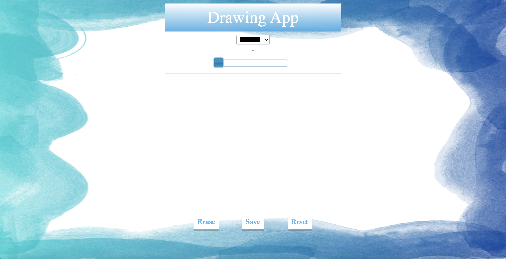

# drawing-app

A simple and intuitive web-based drawing application that allows users to create freehand drawings with different colors and brush sizes. 

## Features

- Freehand drawing on a canvas
- Select brush colors
- Adjust brush size
- Clear the canvas to start fresh

## Technologies Used

- HTML5 Canvas
- JavaScript
- CSS

## How to Use

1. Open `index.html` in your browser.
2. Use your mouse or touch input to draw on the canvas.
3. Select your preferred color and brush size.
4. Click the clear button to erase the canvas.

## Installation

You can clone this repository and open it locally:

git clone https://github.com/luckaty/drawing-app.git
cd drawing-app
open index.html   # Or open it manually in your browser

Contributing
Contributions are welcome! Feel free to fork the repo and submit a pull request with improvements or new features.

License
This project is open source and available under the MIT License.

Made with ❤️ by luckaty
